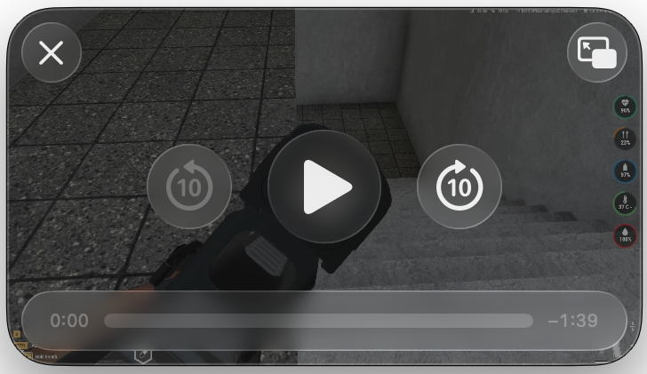

# macOS PiP Private SPI

A Swift proof-of-concept for macOS Picture in Picture using private `PIP.framework` APIs and a file-backed `AVPlayerView`.

| macOS Version | Picture in Picture controls |
| --- | --- |
| macOS 26 |  |

> **Private API — research only.** Do not ship this through the Mac App Store.

## Status

`PIP.framework` has existed since **macOS Sierra**.

## What it demonstrates

- Present a local `AVPlayerView` with `PIPViewController`.
- Handle private PiP playback and skip callbacks.
- Update `PIPMutablePlaybackState` through `updatePlaybackStateUsingBlock:`.

The demo requires a local video file; it includes no simulated playback or media.

## Limitations

- Private APIs are unsupported and may behave differently across macOS releases.
- The project links against the system `PIP.framework`; it does not redistribute Apple framework binaries.
- This repository is a proof-of-concept, not a production-ready PiP library.

For supported applications, use Apple's public `AVPictureInPictureController` API instead.

## Credits

- [PiPHack](https://github.com/steve228uk/PiPHack) provided an early, useful exploration of macOS `PIP.framework` and `PIPViewController`.
